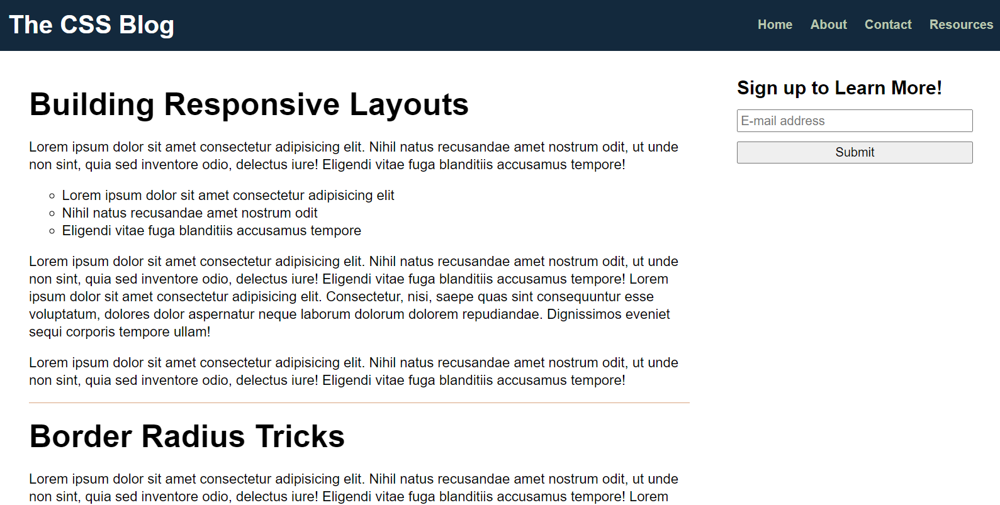

# Code Refactor Starter Code
Code refactored to increase functionality
This project was built to increase knowledge of HTML and CSS, and how to improve on current coding.
Refactoring focused on HTML semantic elements, HTML structure, adding parent and child elements in CSS to reduce code redundcies, and ensuring website meets accesibility standards
I encouter errors with the services images taking up the entire page. This was solved but finding the making the child class 
## User Story 
AS A marketing agency
I WANT a codebase that follows accessibility standards
SO THAT our own site is optimized for search engines

### Acceptance Criteria
-GIVEN a webpage meets accessibility standards
-WHEN I view the source code
THEN I find semantic HTML elements
-WHEN I view the structure of the HTML elements
THEN I find that the elements follow a logical structure independent of styling and positioning
-WHEN I view the heading attributes
THEN they fall in sequential order

-*WHEN I view the image elements
THEN I find accessible alt attributes# 🐛 Custom Font Styles Aren't Loading

Work with a partner to resolve the following issues:

* As a user, I expect headings to be a larger font size.

* As a user, I expect spacing in between the lines of text.

## Expected Behavior

The blog title and article headings should be a larger font size.

## Actual Behavior

The headings are the same size as the other text on the page.

## Assets

The following image demonstrates the web application's appearance:

---

## 💡 Hints

* How can you fix the styling without writing any new CSS rules?

## 🏆 Bonus

If you have completed the activity and want to further your knowledge, work through the following challenge with your partner:

* What is Normalize.css and how does it affect different browsers?

Use [Google](https://www.google.com) or another search engine to research this.

---
© 2023 edX Boot Camps LLC. Confidential and Proprietary. All Rights Reserved.
